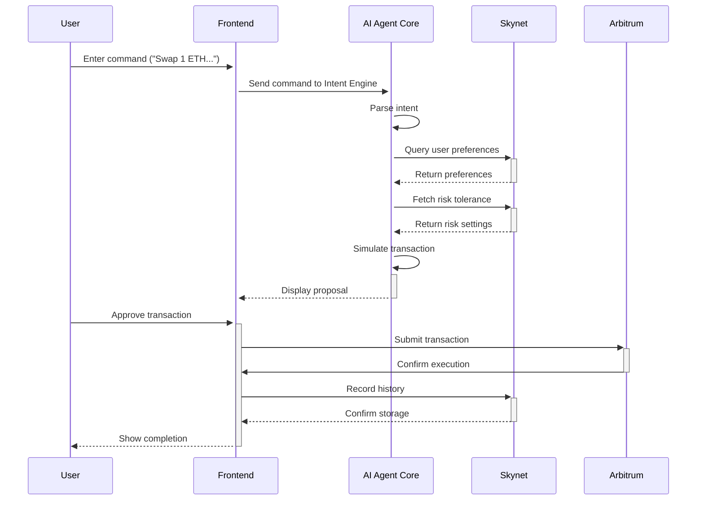

# ArbFlow - Next-Generation AI-Powered DeFi Agent

<div align="center">


ArbFlow is a revolutionary DeFi AI-Agent platform built on Arbitrum

## Smart DeFi Automation

[](https://reactjs.org/)
[](https://openai.com/)
[](https://arbitrum.io/)
[](./LICENSE)

[Live Demo](https://arbflow.vercel.app/) | [Documentation](./documentation) | [Community](./community)

</div>

## Table of Contents

- [Overview](#overview)
- [Key Features](#key-features)
- [Architecture](#architecture)
- [Technology Stack](#technology-stack)
- [Quick Start](#quick-start)
- [Documentation](#documentation)
- [Testing](#testing)
- [Deployment](#deployment)
- [Contributing](#contributing)
- [License](#license)

## Overview

ArbFlow demonstrates the transformative potential of **AI-driven DeFi automation** by creating an intelligent, accessible platform. By leveraging advanced machine learning algorithms, real-time market analysis, and seamless blockchain integration, ArbFlow bridges traditional DeFi complexity with next-generation automated strategies.

To democratize access to DeFi arbitrage opportunities globally by creating an intelligent, transparent, and efficient platform where users can leverage AI-powered strategies to maximize returns while maintaining full custody of their assets on the **Arbitrum Ecosystem**.

## Key Features

### For Traders

- **AI-Powered Opportunity Detection**: Advanced algorithms identify profitable arbitrage opportunities across multiple DEXs
- **Real-time Market Analysis**: Continuous monitoring of price discrepancies and liquidity pools
- **Non-custodial Trading**: Maintain full control of your funds throughout the entire process
- **Risk Assessment Engine**: Comprehensive analysis of potential risks and rewards
- **Natural Language Interface**: Chat with our AI agent using plain English commands
- **Strategy Optimization**: AI-optimized execution paths for maximum profitability

### For DeFi Enthusiasts

- **Educational Dashboard**: Learn about arbitrage strategies and market dynamics
- **Portfolio Analytics**: Track performance and historical trading data
- **Market Intelligence**: Access to real-time market insights and trends
- **Community Features**: Connect with other traders and share strategies
- **Mobile Optimization**: Trade on-the-go with responsive design
- **Multi-wallet Support**: Compatible with popular Web3 wallets

### Platform Features

- **Cross-DEX Integration**: Support for major Arbitrum DEXs (Uniswap, SushiSwap, Balancer, etc.)
- **Gas Optimization**: Smart gas fee management and MEV protection
- **WebSocket Integration**: Real-time price feeds and instant notifications
- **Advanced Analytics**: Comprehensive reporting and performance metrics
- **Security First**: Audited smart contracts and secure wallet integration

## Architecture

ArbFlow follows a modern microservices architecture with clear separation of concerns across frontend, backend, AI services, and blockchain layers.



### Core Workflows

1. **Opportunity Detection Flow**

   - Market Scanning → Price Analysis → Arbitrage Identification → Risk Assessment → Opportunity Notification

2. **Trade Execution Flow**

   - Strategy Selection → Gas Estimation → Transaction Simulation → Execution → Settlement Tracking

3. **AI Chat Flow**
   - User Query → Natural Language Processing → Market Data Retrieval → AI Response → Action Execution

## Technology Stack

### Frontend

- **Framework**: React 18 + TypeScript + Vite
- **UI Components**: shadcn/ui + Radix UI + Tailwind CSS
- **Web3 Integration**: wagmi + RainbowKit + viem
- **State Management**: TanStack Query + Zustand
- **Charts & Visualization**: Recharts + Lucide React Icons
- **Real-time Updates**: Socket.io Client

### Backend

- **Runtime**: Node.js + Express.js + TypeScript
- **Database**: PostgreSQL + Redis + Drizzle ORM
- **Real-time**: Socket.io for WebSocket connections
- **API Design**: RESTful APIs + OpenAPI documentation
- **Caching**: Redis for session and market data caching

### AI & Analytics

- **AI Models**: Custom ML models + OpenAI integration
- **Market Analysis**: Real-time price feed processing
- **Risk Assessment**: Multi-factor risk scoring algorithms
- **Natural Language**: GPT-powered chat interface
- **Data Processing**: Time-series analysis for market trends

### Blockchain

- **Network**: Arbitrum One (Mainnet) + Arbitrum Sepolia (Testnet)
- **DEX Integration**: Uniswap V3, SushiSwap, Balancer, Curve
- **Wallet Support**: MetaMask, WalletConnect, Coinbase Wallet
- **Transaction Management**: Gas optimization + MEV protection

### DevOps & Infrastructure

- **Build Tools**: Vite + ESBuild + TypeScript
- **Testing**: Vitest + React Testing Library
- **Linting**: ESLint + TypeScript ESLint + Prettier
- **Deployment**: Vercel + Railway + Docker
- **Monitoring**: Real-time error tracking + performance monitoring

## Quick Start

### Prerequisites

- Node.js v18+ and npm/yarn
- Git
- MetaMask or compatible Web3 wallet
- Arbitrum testnet ETH (for testing)

### 1. Clone and Setup

```bash
# Clone the repository
git clone https://github.com/aniketsahu115/ArbFlow.git
cd ArbFlow

# Install dependencies
npm install

# Copy environment variables
cp .env.example .env
# Fill in required values in .env file
```

### 2. Environment Configuration

Create a `.env` file with the following variables:

```env
# Application Configuration
NODE_ENV=development
PORT=5000

# Database Configuration
DATABASE_URL=postgresql://localhost:5432/arbflow
REDIS_URL=redis://localhost:6379

# Blockchain Configuration
ARBITRUM_RPC_URL=https://arb1.arbitrum.io/rpc
ARBITRUM_SEPOLIA_RPC_URL=https://sepolia-rollup.arbitrum.io/rpc

# API Keys
ALCHEMY_API_KEY=your_alchemy_api_key
OPENAI_API_KEY=your_openai_api_key
COINGECKO_API_KEY=your_coingecko_api_key

# Frontend Configuration
VITE_APP_ENVIRONMENT=development
VITE_ENABLE_ANALYTICS=false
```

### 3. Development Mode

```bash
# Start the development server
npm run dev

# The application will be available at:
# Frontend: http://localhost:5000
# API: http://localhost:5000/api
```

### 4. Access the Application

- **Frontend**: http://localhost:5000
- **Documentation**: http://localhost:5000/documentation
- **FAQ**: http://localhost:5000/faq
- **Community**: http://localhost:5000/community

## Core Features

### AI-Powered Market Analysis

ArbFlow's intelligent market analysis engine continuously monitors multiple data sources:

- **Price Feeds**: Real-time price data from 10+ DEXs on Arbitrum
- **Liquidity Analysis**: Pool depth and slippage calculations
- **Gas Optimization**: Dynamic gas fee estimation and MEV protection
- **Risk Scoring**: Multi-factor risk assessment for each opportunity

### Supported DEXs

| DEX            | Integration | TVL    | Supported Pairs |
| -------------- | ----------- | ------ | --------------- |
| **Uniswap V3** | ✅ Active   | $500M+ | 200+            |
| **SushiSwap**  | ✅ Active   | $100M+ | 150+            |
| **Balancer**   | ✅ Active   | $50M+  | 100+            |
| **Curve**      | ✅ Active   | $200M+ | 50+             |
| **Camelot**    | 🔄 Planned  | $80M+  | 80+             |
| **GMX**        | 🔄 Planned  | $300M+ | 20+             |

### API Endpoints

#### Market Data

```
GET  /api/market/opportunities     # Get current arbitrage opportunities
GET  /api/market/prices           # Real-time price data
GET  /api/market/analytics        # Market statistics and trends
GET  /api/market/dexs             # Supported DEX information
```

#### Trading

```
POST /api/trading/simulate        # Simulate arbitrage execution
POST /api/trading/execute         # Execute arbitrage opportunity
GET  /api/trading/history         # User trading history
GET  /api/trading/performance     # Portfolio performance metrics
```

#### AI Chat

```
POST /api/chat/query              # Send query to AI agent
GET  /api/chat/history            # Chat conversation history
POST /api/chat/execute            # Execute AI-suggested action
```

## Testing

### Frontend Tests

```bash
# Run frontend tests
npm run test

# Run tests in watch mode
npm run test:watch

# Generate coverage report
npm run test:coverage
```

### API Tests

```bash
# Run API integration tests
npm run test:api

# Run specific test suites
npm run test:market
npm run test:trading
```

### End-to-End Tests

```bash
# Run full E2E test suite
npm run test:e2e

# Test specific user flows
npm run test:arbitrage-flow
```

## Deployment

### Production Build

```bash
# Build for production
npm run build

# Start production server
npm run start
```

### Environment Deployment

```bash
# Deploy to staging
npm run deploy:staging

# Deploy to production
npm run deploy:production
```

## Feature Implementation Status

| Feature Category        | Progress | Status      |
| ----------------------- | -------- | ----------- |
| **Core Infrastructure** | 100%     | Complete    |
| **AI Market Analysis**  | 95%      | Functional  |
| **Arbitrage Detection** | 90%      | Operational |
| **User Interface**      | 100%     | Complete    |
| **Wallet Integration**  | 100%     | Complete    |
| **Real-time Analytics** | 85%      | Active      |
| **Risk Assessment**     | 80%      | In Progress |
| **Trading Automation**  | 75%      | Development |
| **Mobile Optimization** | 100%     | Responsive  |
| **Multi-DEX Support**   | 70%      | Expanding   |
| **Gas Optimization**    | 85%      | Efficient   |
| **Security Audits**     | 60%      | Ongoing     |

**Overall Progress**: 87% Complete

## Contributing

1. **Fork the repository**
2. **Create feature branch**: `git checkout -b feature/amazing-feature`
3. **Commit changes**: `git commit -m 'Add amazing feature'`
4. **Push to branch**: `git push origin feature/amazing-feature`
5. **Open Pull Request**

## License

This project is licensed under the MIT License - see the [LICENSE](LICENSE) file for details.

## Support

- **Documentation**: [/documentation](./documentation)
- **Community**: [/community](./community)
- **FAQ**: [/faq](./faq)
- **Issues**: [GitHub Issues](https://github.com/aniketsahu115/ArbFlow/issues)
- **Support**: [/support](./support)

## Acknowledgments

- **Arbitrum** for Layer 2 scaling solution and ecosystem support
- **OpenAI** for advanced AI capabilities and natural language processing
- **Uniswap** and other DEX protocols for liquidity and trading infrastructure
- **shadcn/ui** for beautiful and accessible UI components
- **The DeFi Community** for continuous innovation and collaboration

---

## Future ArbFlow Vision

### Phase 1: Core Platform (Current)

- AI-powered arbitrage detection
- Multi-DEX integration
- Real-time market analysis
- Basic trading automation

### Phase 2: Advanced Automation (3-6 months)

- Automated strategy execution
- Advanced risk management
- Cross-chain arbitrage opportunities
- Professional trading tools

### Phase 3: Ecosystem Expansion (6-12 months)

- Multiple blockchain support
- Advanced AI strategies
- Institutional features
- API partnerships

### Phase 4: DeFi Innovation (1-2 years)

- Custom strategy creation
- Social trading features
- Educational platform
- Regulatory compliance tools

## Measuring Success

### Platform Metrics

- **Trading Volume**: $10M+ processed monthly
- **User Growth**: 5,000+ active traders
- **Arbitrage Opportunities**: 100+ identified daily
- **Success Rate**: 85%+ profitable trades

### Innovation Metrics

- **AI Accuracy**: 90%+ opportunity prediction rate
- **Gas Efficiency**: 40% reduction in transaction costs
- **Speed Advantage**: <2 second opportunity detection
- **Risk Management**: 95% uptime with zero major losses

## Conclusion

ArbFlow demonstrates that AI-powered DeFi automation is not just possible—it's the future of decentralized trading. By focusing on arbitrage opportunities as a gateway to broader DeFi strategies, we show how artificial intelligence can make sophisticated trading accessible to everyone while maintaining the security and decentralization that makes DeFi revolutionary.

The future of DeFi trading lies in intelligent automation that empowers users rather than replacing them. ArbFlow is building that future on the **Arbitrum Ecosystem**, one arbitrage opportunity at a time.
