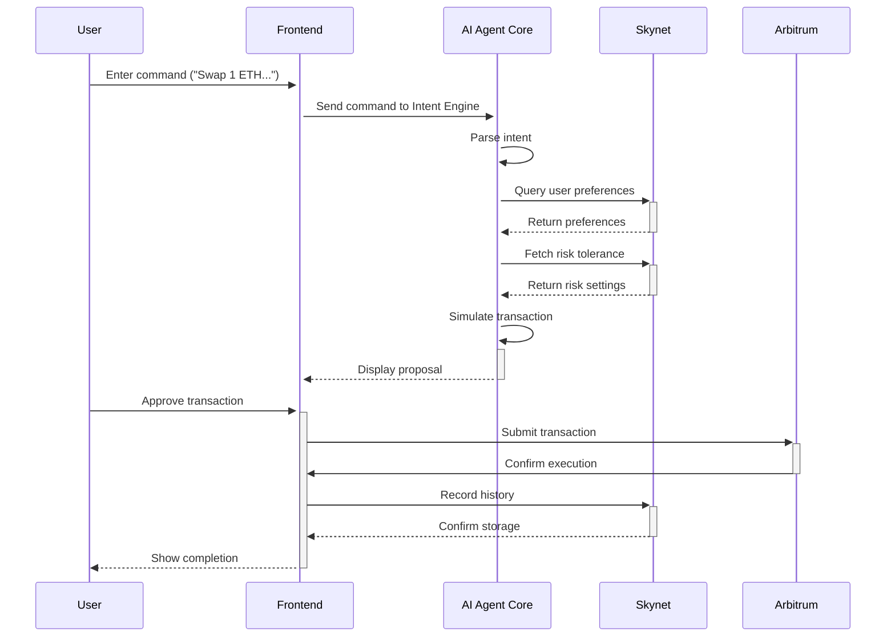

# ArbFlow - Next-Generation AI-Powered DeFi Agent

<div align="center">


ArbFlow is a AI-Agent DApp built on Arbitrum Orbit leveraging **Skynet Protocol** and **Li.Fi Bridge & DEX Aggregation Protocol**

## Smart DeFi Automation

</div>

## Table of Contents

- [Overview](#overview)
- [Key Features](#key-features)
- [Architecture](#architecture)
- [Technology Stack](#technology-stack)
- [Quick Start](#quick-start)
- [Documentation](#documentation)
- [Testing](#testing)
- [Deployment](#deployment)
- [Contributing](#contributing)
- [License](#license)

## Overview

ArbFlow demonstrates the transformative potential of AI-driven DeFi automation by creating an intelligent, accessible platform. By leveraging advanced natural language processing, machine learning, real-time market analysis, and decentralized infrastructure, ArbFlow bridges DeFi complexity with user-sovereign automation.

The purpose is to democratize access to DeFi activities such as liquid staking, swaps, bridging, yield optimization, rebalancing, and token research. ArbFlow empowers users to interact with DeFi using simple NLP commands while maintaining verifiability, transparency, and full custody of their assets on the Arbitrum Ecosystem.

## Integrations and Protocols -
ArbFlow integrates with powerful decentralized infrastructure and liquidity protocols to ensure secure, efficient, and scalable automation across DeFi:

- **Skynet Protocol** – Provides decentralized, verifiable, and censorship-resistant infrastructure for ArbFlow’s AI agents. This ensures computations and intent executions are transparent, trustless, and not dependent on centralized servers.
- **Li.Fi Bridge & DEX Aggregation Protocol** – Powers cross-chain asset transfers with deep liquidity and optimal routing, enabling ArbFlow to execute user intents seamlessly across multiple ecosystems.

## Key Features

### For Users

- **AI-Agent with NLP Interface**: Execute DeFi actions (stake, swap, yield, bridge) with natural language commands
- **Non-custodial Execution**: Maintain full control of your funds throughout all processes
- **Risk Assessment Engine**: Assess potential risks including impermanent loss, slippage, and market volatility
- **Predictive Yield Optimization**: AI-driven forecasting for higher yield opportunities
- **Natural Language Interface**: Chat with our AI agent using plain English commands
- **Strategy Optimization**: AI-optimized execution paths for maximum profitability
- **Intent Verification**: User-sovereign, verifiable AI agent ensures actions align with user approvals
- **Portfolio Automation**: Automated rebalancing and strategy execution

### For DeFi Enthusiasts

- **Educational Dashboard**: Learn about arbitrage strategies and market dynamics
- **Portfolio Analytics**: Track performance and historical trading data
- **Market Intelligence**: Access real-time token research, insights, and predictions
- **Community Features**: Connect with other DeFi users and share strategies
- **Mobile Optimization**: Manage DeFi activities on-the-go
- **Multi-wallet Support**: Compatible with popular Web3 wallets

### Platform Features

- **Cross-DEX Integration**: Support for major Arbitrum DEXs (Uniswap, SushiSwap, Balancer, etc.)
- **Decentralized Infra**: Powered by Skynet Protocol for data hosting and verifiable AI
- **Gas Optimization**: Smart gas fee management and MEV protection
- **WebSocket Integration**: Real-time price feeds and instant notifications
- **Advanced Analytics**: Comprehensive reporting and performance metrics
- **Security First**: Audited smart contracts and secure wallet integration


## Architecture

ArbFlow follows a modern microservices architecture with clear separation of concerns across frontend, backend, AI services, and blockchain layers.



### Core Workflows

1. **DeFi Action Flow**

  - NLP Command → Intent Parsing → Strategy Generation → Risk Assessment → Proposal Display → User Approval → Execution

2. **Portfolio Optimization Flow**

  - Strategy Selection → Predictive Yield Forecasting → Risk Mitigation → Execution → Settlement Tracking

3. **AI Chat Flow**
   - User Query → Natural Language Processing → Market Data Retrieval → AI Response → Action Execution

### AI & Analytics

- **AI Models**: Custom ML models + Skynet Protocol integration
- **Market Analysis**: Real-time price feed processing
- **Risk Assessment**: Multi-factor risk scoring algorithms
- **Natural Language**: GPT-powered chat interface
- **Data Processing**: Time-series analysis for market trends

### Blockchain

- **Network**: Arbitrum Orbit (Mainnet)
- **DEX Integration**: Uniswap V3, SushiSwap, Balancer, Curve
- **Wallet Support**: MetaMask, WalletConnect, Coinbase Wallet
- **Transaction Management**: Gas optimization + MEV protection

### 1. Clone and Setup

```bash
# Clone the repository
git clone
cd ArbFlow

# Install dependencies
npm install

# Copy environment variables
cp .env.example .env
# Fill in required values in .env file
```

### 2. Environment Configuration

Create a `.env` file with the following variables:

```env
# Application Configuration
NODE_ENV=development
PORT=5000

# Database Configuration
DATABASE_URL=postgresql://localhost:5432/arbflow
REDIS_URL=redis://localhost:6379

# Blockchain Configuration
ARBITRUM_RPC_URL=https://arb1.arbitrum.io/rpc
ARBITRUM_SEPOLIA_RPC_URL=https://sepolia-rollup.arbitrum.io/rpc

# API Keys
ALCHEMY_API_KEY=your_alchemy_api_key
SKYNET_API_KEY=your_skynet_api_key
COINGECKO_API_KEY=your_coingecko_api_key

# Frontend Configuration
VITE_APP_ENVIRONMENT=development
VITE_ENABLE_ANALYTICS=false
```

### 3. Development Mode

```bash
# Start the development server
npm run dev

# The application will be available at:
# Frontend: http://localhost:5000
# API: http://localhost:5000/api
```

### 4. Access the Application

- **Frontend**: http://localhost:5000
- **Documentation**: http://localhost:5000/documentation
- **FAQ**: http://localhost:5000/faq
- **Community**: http://localhost:5000/community

## Core Features

### AI-Powered Market & Yield Analysis

ArbFlow's intelligent engine continuously monitors multiple data sources:

- **Price Feeds**: Real-time price data from 10+ DEXs on Arbitrum
- **Liquidity Analysis**: Pool depth and slippage calculations
- **Yield Analysis**: Compare yields across lending and staking protocols
- **Gas Optimization**: Dynamic gas fee estimation and MEV protection
- **Risk Scoring**: Multi-factor risk assessment for each opportunity
- **Predictive Yield**: Forecast future yields using ML models

### API Endpoints

#### Market Data

```
GET  /api/market/opportunities     # Get current arbitrage opportunities
GET  /api/market/prices           # Real-time price data
GET  /api/market/analytics        # Market statistics and trends
GET  /api/market/dexs             # Supported DEX information
```

#### Trading

```
POST /api/trading/simulate        # Simulate arbitrage execution
POST /api/trading/execute         # Execute arbitrage opportunity
GET  /api/trading/history         # User trading history
GET  /api/trading/performance     # Portfolio performance metrics
```

#### AI Chat

```
POST /api/chat/query              # Send query to AI agent
GET  /api/chat/history            # Chat conversation history
POST /api/chat/execute            # Execute AI-suggested action
```

## Testing

### Frontend Tests

```bash
# Run frontend tests
npm run test

# Run tests in watch mode
npm run test:watch

# Generate coverage report
npm run test:coverage
```

### API Tests

```bash
# Run API integration tests
npm run test:api

# Run specific test suites
npm run test:market
npm run test:trading
```

### End-to-End Tests

```bash
# Run full E2E test suite
npm run test:e2e

# Test specific user flows
npm run test:arbitrage-flow
```

## Deployment

### Production Build

```bash
# Build for production
npm run build

# Start production server
npm run start
```

### Environment Deployment

```bash
# Deploy to staging
npm run deploy:staging

# Deploy to production
npm run deploy:production
```

## Feature Implementation Status

| Feature Category        | Progress | Status      |
| ----------------------- | -------- | ----------- |
| **Core Infrastructure** | 100%     | Complete    |
| **AI Market Analysis**  | 95%      | Functional  |
| **Arbitrage Detection** | 90%      | Operational |
| **User Interface**      | 100%     | Complete    |
| **Wallet Integration**  | 100%     | Complete    |
| **Real-time Analytics** | 85%      | Active      |
| **Risk Assessment**     | 80%      | In Progress |
| **Yield Optimization**  | 75%      | Development |
| **Mobile Optimization** | 100%     | Responsive  |
| **Multi-DEX Support**   | 70%      | Expanding   |
| **Gas Optimization**    | 85%      | Efficient   |
| **Security Audits**     | 60%      | Ongoing     |

**Overall Progress**: 87% Complete

## Contributing

1. **Fork the repository**
2. **Create feature branch**: `git checkout -b feature/amazing-feature`
3. **Commit changes**: `git commit -m 'Add amazing feature'`
4. **Push to branch**: `git push origin feature/amazing-feature`
5. **Open Pull Request**

## License

This project is licensed under the MIT License - see the [LICENSE](LICENSE) file for details.

## Support

- **Documentation**: [/documentation](./documentation)
- **Community**: [/community](./community)
- **FAQ**: [/faq](./faq)
- **Issues**: [GitHub Issues](https://github.com/aniketsahu115/ArbFlow/issues)
- **Support**: [/support](./support)

## Acknowledgments

- **Arbitrum** for Layer 2 scaling solution and ecosystem support
- **Skynet Protocol** for advanced AI capabilities and natural language processing
- **Uniswap** and other DEX protocols for liquidity and trading infrastructure
- **The DeFi Community** for continuous innovation and collaboration

---

## Future ArbFlow Vision

### Phase 1: Core Platform (Current)

- NLP-based DeFi automation
- Multi-DEX integration
- Real-time market and yield analysis
- Basic portfolio automation

### Phase 2: Advanced Automation (3-6 months)

- Automated strategy execution
- Advanced risk management including IL mitigation
- Cross-chain bridging and multi-chain yield
- Professional DeFi dashboards

### Phase 3: Ecosystem Expansion (6-12 months)

- Multiple blockchain support
- Advanced AI strategies
- Institutional features
- API partnerships

### Phase 4: DeFi Innovation (1-2 years)

- Custom strategy creation
- Social trading features
- Educational platform
- Regulatory compliance tools

## Conclusion
ArbFlow represents the next step in onchain finance where AI agents act as user-sovereign co-pilots, simplifying complex strategies and empowering intent-driven automation. By combining decentralized infrastructure via **Skynet Protocol**, seamless cross-chain execution through **Li.Fi Bridge, and efficient swaps with DEX aggregation**, ArbFlow delivers an all-in-one platform for staking, yield optimization, rebalancing, bridging, and more.
